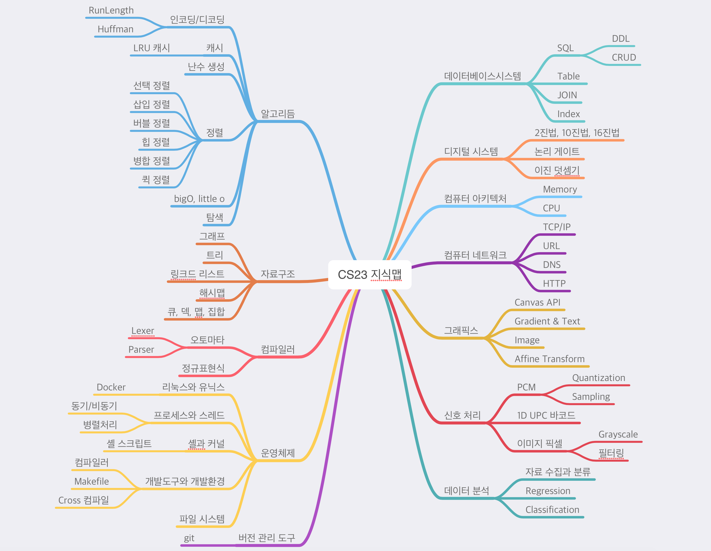
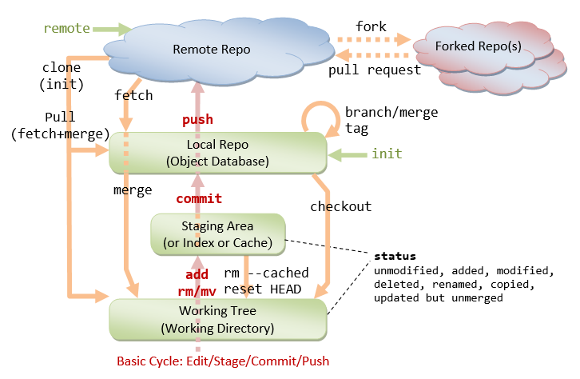

# 읽을거리


함수와 객체(생성자)모두 인자를 좀더 잘 활용해보세요!
이런식. crong

```
const b = new MyObject({printer : myPrinter, level:4 });
const myPrinter = new Printer({type:"people", timeout:1000});
```


에러처리에 대해서 고민중이신 거 같아서 참고하시라고, 짧게 써봤습니다.

crong 


```[에러처리]


제가 에러처리를 하라고 해서 다 사용하고 계신데요.
사실 Try-catch 안하고 지금 과제를 할 수 있답니다. (물론 공부해서 적용한 것이 기특기특 합니다)


에러란 무엇인가? 
에러는 예상하기 어려운 값에 의해서 생기게 됩니다.
js는 동적으로 타입이 결정되는 방식이라, 런타임과정에서 에러가 더 잘 생길수도 있어요. 
에러가 발생하면 프로그램이 멈추고 더이상 일을 안하려고 하죠.  에러내용도 불친절하기도 하고요.
한마디로 에러가 생기면 프로그래밍 어떻게 되는지 지멋대로라 당황한 상황이 생길 수 있어요.
다행히도 에러상황을 **우리가 제어하도록** 프로그램이 제공합니다. 


에러를 제어함으로써 우리는 이런 것을 얻을 수 있어요

- 에러상황을 우리가  제어할 수 있음
- 친절하게 에러메시지를 노출할 수 있음 (사실 다른 개발자에게 디버깅을 편리하게 하기 위함이 커요. 그래서 라이브러리는 에러처리가 아주 더 잘 되어 있고요)
- 에러발생을 로깅할 수도 있음(모니터링)


Try-catch-finally (이하 TCF)를 사용하는 것이 대표적이죠. 
이걸 모든 서비스코드에 많이 사용하진 않아요. 
주로 예상하기 어려운 상황이나 (http, db와 통신과정, file io등), 라이브러리에서 많이 사용하죠.


tcf문은 다른 코드문과 다른 부분이 있긴해요. 그래서 낯설고 어색합니다.
짧게 요약하면, 에러가 발생하면 catch로 가고, finally는 늘 실행됩니다(여러분들이 finally 를 잘 활용 못하고 있음)
우리가 에러를 직접 발생시킬수도 있죠. (지금 여러분들이 많이 하고 계시는 건데 throw문이죠.
throw "오마이갓", throw new Error("오마이갓"), 이런게 다 올바른 에러발생문이라고 볼 수 있어요. 가장 나은 방법은 new Error를 그래도 붙여주는 게 좋은데 그 이유도 찾아보세요!

맘껏 쓰세요.```
```

JK [Apr 23rd at 7:40 PM]
Jump
자 emacs 말고 vim 개발자 모이세요. http://blog.b1ue.sh/2016/10/09/vim-ide/ 


Honux   [Apr 24th at 1:23 PM]
https://youtu.be/x8P_jDOcl-8
YouTube코드스쿼드
커밋하면 스테이지의 내용은 어디로 갈까?


Honux [4:41 PM]
백준에서 JS로 문제 풀 때는 https://es6console.com/ 쓰면 편해요. 아니면 로컬에서 babel로 변환하거나

crong [2:19 PM]
예를들어 이런것)
https://github.com/vuejs/vue/blob/dev/.github/COMMIT_CONVENTION.md


JK [Apr 16th at 6:34 PM]
Jump
CS23 지식맵을 그려봤습니다. 앞으로도 업데이트할게요.




JK [Apr 16th at 7:47 AM]
Jump
좋은 아침입니다. 출근길에 가볍게 읽어보세요. http://m.hanbit.co.kr//channel/category/category_view.html?cms_code=CMS8508522519&cate_cd=


 [메모리 레이아웃의 이해_bOBaNa (1).pdf](./img/메모리 레이아웃의 이해_bOBaNa (1).pdf) 


Honux [Apr 8th at 3:29 PM]
Jump
@channel
여러분 깃헙이나 자료 보고 있다가 공통적으로 발견한 문제점 알려드립니다.
- 코드스쿼드 자료를 그대로 복붙해서 외부에 오픈하는 것은 안 됨, 공부한 내용을 정리해서 올리는 것은 가능
- 코드스쿼드 뿐만 아니라 외부에서 참고/ 인용한 글은 출처/ 라이센스를 정확하게 표기할 것


Hngfu [Apr 6th at 12:02 PM]
Jump
https://www.nis.go.kr:4016/CM/1_5_1/view.do?seq=3565&currentPage=1&selectBox=&searchKeyword=&fromDate=&toDate=


Honux [Apr 5th at 3:34 PM]
Jump
https://cstack.github.io/db_tutorial/?fbclid=IwAR1Nbl69CtbbA9FMjAk6TkEWkXKngPFy_sso-XTROtuu8JolcOgEUo238c8


Corn [Apr 4th at 2:59 PM]
Jump
[페이스북 초보개발자모임]

지난 WTD2019 발표에서 만난 학생분이 저에게 3가지 질문을 주셨습니다.
백엔드 신입 개발자로서 궁금하셨던 내용들이라 다른 분들도 이런 내용들은 궁금해 하실것같아 블로그에 정리해보았습니다.

다시 신입 공채가 시작되는 시즌입니다!

다들 힘내셔서 꼭 원하시는 회사 가시길 바랍니다 :)

https://jojoldu.tistory.com/413


Seldev [Apr 4th at 8:05 PM]
Jump
Pasted image at 2019-04-04, 8:05 PM




JK [Apr 1st at 12:49 PM]
Jump
오전에 얘기했던 저보다 더 진지한 분. 글입니다. 식사하고 오셔서 읽어보세요 https://brunch.co.kr/@javajigi/4


Honux [Apr 2nd at 4:49 PM]
Jump
https://sinoroo.tistory.com/entry/VIM-%ED%8A%9C%ED%86%A0%EB%A6%AC%EC%96%BC'


노수진 라인 [Swift 개발자처럼 변수 이름 짓기](https://soojin.ro/blog/english-for-developers-swift)

<https://soojin.ro/blog/page2/>


Honux [11:47 AM]
https://www.youtube.com/watch?v=Sb3fMvIIsqQ&list=PLAHa1zfLtLiOsxl0ScW0K3Z31cE4tLfk5&index=2
YouTube코드스쿼드
내가 TDD에 집착하는 이유는?


Honux [10:29 AM]
https://andole87.github.io/idea/woowahan-course/#
Y++
우아한테크코스 - 프리코스까지


Honux [10:32 PM]
https://speakerdeck.com/pluu/code-review
Speaker Deck
Code Review
회사 사내 팀에서 라이트닝토크로 발표한 Code Review에 대한 발표자료입니다.
코드 리뷰 가이드인데 셀프 점검 사항으로 봐도 될 것 같아요.
객체지향 체조 원칙도 한 번 보세요.
https://developerfarm.wordpress.com/2012/02/03/object_calisthenics_summary/


Honux [3:03 PM]
https://goe0866-my.sharepoint.com/:b:/g/personal/honux77_pangyoe_goe_go_kr/ESD8dGTYRiZMgEJI_lVgs2UB4jFahQNia3on3QrUSlhiPQ?e=wDpvsv (edited) 

오늘 스캔한 책인데 2012년도 책이고 웹에서 볼 수 있는 내용이지만 공유해 드려요.

Honux [3:04 PM]
목차가 참 좋으니 시간될때 목차라도 보세요.


##### The 10 Best JavaScript ES6 Features

<https://www.lifewire.com/best-javascript-es6-features-4579821>


crong [10:04 AM]
(생각보다 어려운)자바스크립트 모듈이야기.

https://youtu.be/WGlT921ixx4
YouTubeCodemotion
Unbundling the JavaScript module bundler by Luciano Mammino

몇 년간 이어온 흐름을 이해하기 좋아보이네요.


JK [6:43 PM]
자료구조 알고리듬 공부할 때 좋은 자료네요 https://hackerwins.github.io/2019-05-10/search-tree
hackerwins blog
아는만큼 Search tree
회사 일을 하면서 자료구조를 구현할 기회는 별로 없었다. 하지만 최근에 데이터 타입 기반 동기화 플랫폼을 개발하면서 운 좋게도 일부 자료구조를 직접 구현해야만 했다. 나중에 잊어버리는 것보다는 짧은 지식이라도 적는게 나은 것 같아서 아는 만큼이라도 기록하기로 했다. 이 글은 마지막에 있는 링크들을 참고해서 정리했다.